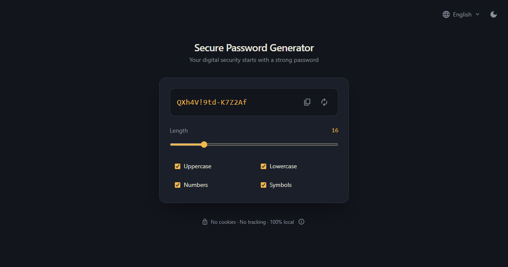

# Secure Password Generator

**English** · [Español](README.es.md)

A client-side password generator built with vanilla JavaScript and Tailwind CSS. Passwords are generated with the Web Crypto API and never leave your device.

**Live demo:** https://secure-password-generator-b96.pages.dev/



## Features

- Cryptographically secure passwords from 8 to 50 characters, with uppercase letters, lowercase letters, numbers and symbols.
- One-click copy with visual feedback, and a clear message when copying isn't possible.
- Dark and light themes.
- Interface in English, Spanish, Portuguese (Brazil) and French, detected from the browser language.
- Your language, theme and options are remembered between visits.
- Works on desktop and mobile, with mouse, touch or keyboard.

## Security and privacy

- **Secure randomness:** every character comes from `crypto.getRandomValues`, never `Math.random`. Random indexes use rejection sampling to avoid the modulo bias of `value % n`.
- **Uniform shuffle:** the password guarantees at least one character of each selected type, then mixes them with a Fisher–Yates shuffle. Sorting with a random comparator was ruled out because it isn't uniform: in a test of 200,000 shuffles, the first character stayed in place 17.1% of the time instead of the expected 8.3%.
- **Nothing is sent anywhere:** a strict Content-Security-Policy (`connect-src 'none'`, same-origin scripts, styles and images only) means the browser itself blocks any attempt to send data to another server.
- **Security headers:** the site is served with `frame-ancestors 'none'`, `X-Frame-Options`, `X-Content-Type-Options`, `Referrer-Policy` and `Permissions-Policy` (see [`_headers`](_headers)).
- **No cookies, no tracking, no third-party scripts.** Preferences are stored only in `localStorage`, and the app still works if the browser blocks it (it just doesn't remember your choices).

## Accessibility

- Full keyboard navigation with visible focus on every control.
- Screen reader announcements for copy results and configuration errors through a single live region.
- The language menu and the privacy info button follow WAI-ARIA patterns and work with hover, touch and keyboard.
- Animations respect `prefers-reduced-motion`.

## Tech stack

- HTML and vanilla JavaScript (ES modules), with no framework or bundler.
- [Tailwind CSS v4](https://tailwindcss.com/), compiled with the Tailwind CLI.
- Hosted on [Cloudflare Pages](https://pages.cloudflare.com/).

## Project structure

```
index.html            Markup, Tailwind classes and metadata
_headers              HTTP security headers for Cloudflare Pages
src/
  index.js            Entry point: wires events, renders the password
  password.js         generatePassword(): pure, no DOM
  animations.js       Scramble and wave animations
  i18n.js             Language detection and translation
  translations.js     Translation dictionary (4 languages)
  language-menu.js    Accessible language dropdown
  privacy-info.js     Privacy details disclosure in the footer
  theme.js            Theme toggle
  theme-init.js       Applies the saved theme before first paint
  preferences.js      Saves and restores generator options
  storage.js          Safe localStorage access
  input.css           Tailwind entry point and design tokens
  styles.css          Compiled CSS (generated, committed)
```

## Running locally

Requires Node.js 24.20.0 or later.

```bash
npm install
npm run dev        # recompiles the CSS on every change
npx serve .        # in another terminal, serves the app
```

Open the URL that `serve` prints. The app must be served over HTTP; opening `index.html` directly (`file://`) doesn't work because ES modules don't load there.

Before committing, compile the minified CSS:

```bash
npm run build
```

## Deployment

Cloudflare Pages deploys the repository root as-is on every push to `main`. There is no build step on the server, so the compiled `src/styles.css` must be committed.

## Development workflow

I designed and developed this project with [Claude Code](https://claude.com/claude-code) as an AI assistant. I defined the requirements, made the product, design and security decisions, and reviewed every change before committing it. The assistant helped me compare implementation options, speed up repetitive work and automate browser testing with headless Chrome and Puppeteer: simulating a touch phone, using the app with the keyboard only, checking that the security policy (CSP) didn't block anything from the app itself, and repeating quick back-to-back actions, like unchecking options while an animation is running.

As part of that process I did a full code review, which found several bugs: the way characters were shuffled wasn't fully random (the issue explained in the security section), the app failed to start when the browser blocked `localStorage`, and some animations could hide error messages. I verified each fix by reproducing the bug before and after correcting it.

## License

[MIT](LICENSE) © johnjanieltr
